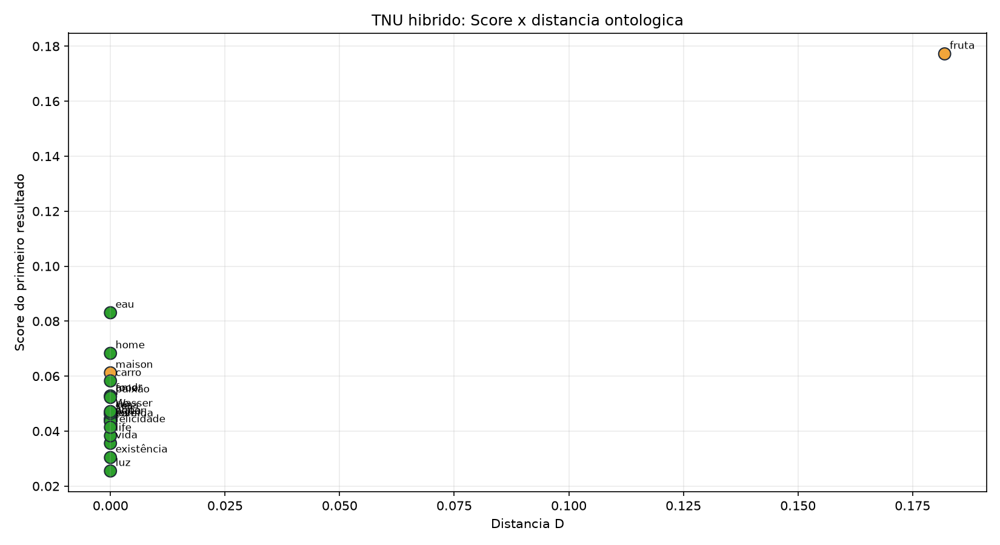
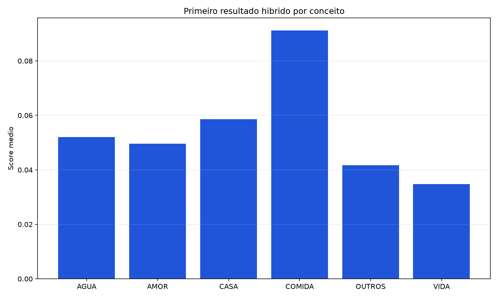
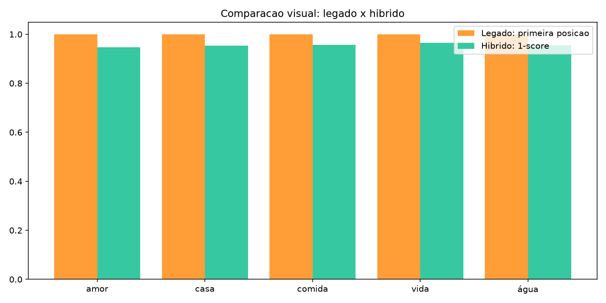

# Relatorio de testes do TNU

Data: 2026-08-03T23:16:05
Testes: 26; sucessos: 26

## Graficos

## Resultados
### água (pt -> en)

- **Hibrido**: `water` (score=0.0444; D=0.000; same)
- **Legado**: `devotion` (sem score/D no modo legado)

### water (en -> pt)

- **Hibrido**: `água` (score=0.0444; D=0.000; same)

### sea (en -> pt)

- **Hibrido**: `mar` (score=0.0461; D=0.000; same)

### rio (pt -> en)

- **Hibrido**: `river` (score=0.0470; D=0.000; same)

### comida (pt -> en)

- **Hibrido**: `foodstuff` (score=0.0436; D=0.000; same)
- **Legado**: `residence` (sem score/D no modo legado)

### food (en -> pt)

- **Hibrido**: `comida` (score=0.0527; D=0.000; same)

### fruta (pt -> en)

- **Hibrido**: `foodstuff` (score=0.1772; D=0.182; related)

### amor (pt -> en)

- **Hibrido**: `love` (score=0.0528; D=0.000; same)
- **Legado**: `residence` (sem score/D no modo legado)

### love (en -> pt)

- **Hibrido**: `amor` (score=0.0436; D=0.000; same)

### paixão (pt -> en)

- **Hibrido**: `passion` (score=0.0523; D=0.000; same)

### casa (pt -> en)

- **Hibrido**: `house` (score=0.0465; D=0.000; same)
- **Legado**: `food` (sem score/D no modo legado)

### home (en -> pt)

- **Hibrido**: `lar` (score=0.0683; D=0.000; same)

### vida (pt -> en)

- **Hibrido**: `life` (score=0.0356; D=0.000; same)
- **Legado**: `light` (sem score/D no modo legado)

### life (en -> pt)

- **Hibrido**: `vida` (score=0.0383; D=0.000; same)

### existência (pt -> en)

- **Hibrido**: `existence` (score=0.0304; D=0.000; same)

### luz (pt -> en)

- **Hibrido**: `light` (score=0.0255; D=0.000; same)

### eau (fr -> pt)

- **Hibrido**: `água` (score=0.0831; D=0.000; same)

### Wasser (de -> en)

- **Hibrido**: `water` (score=0.0471; D=0.000; same)

### maison (fr -> en)

- **Hibrido**: `residence` (score=0.0612; D=0.000; related)

### carro (pt -> en)

- **Hibrido**: `car` (score=0.0583; D=0.000; same)

### felicidade (pt -> en)

- **Hibrido**: `happiness` (score=0.0414; D=0.000; same)
